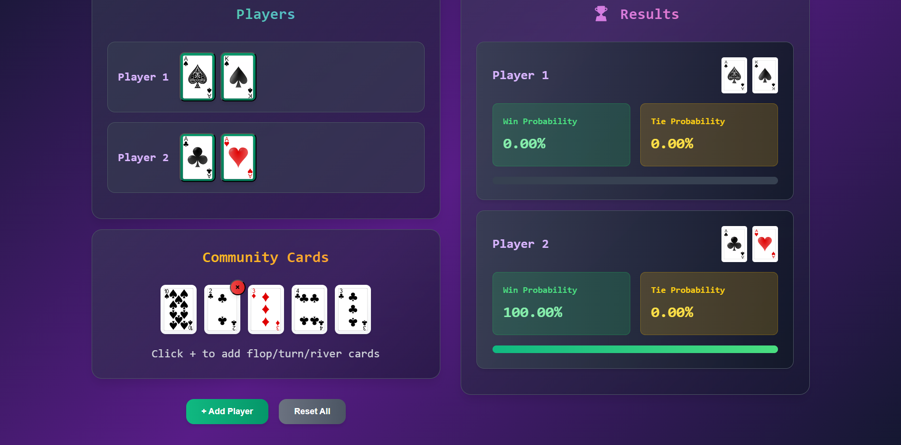
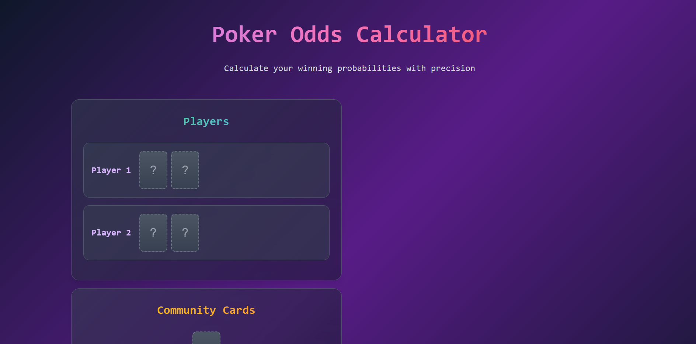
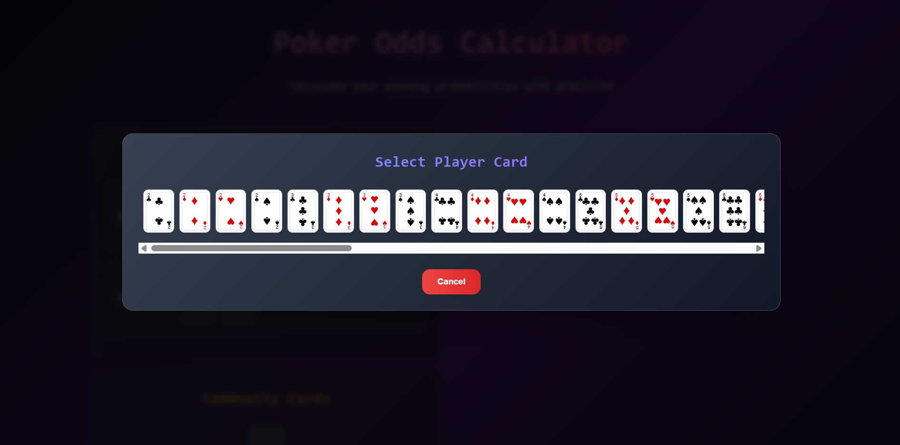
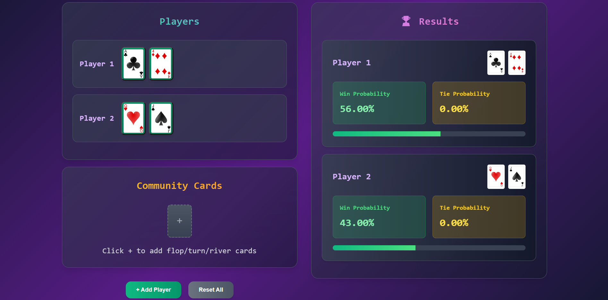
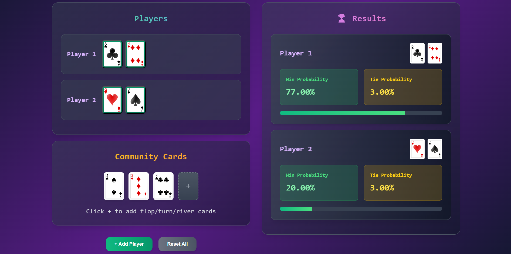
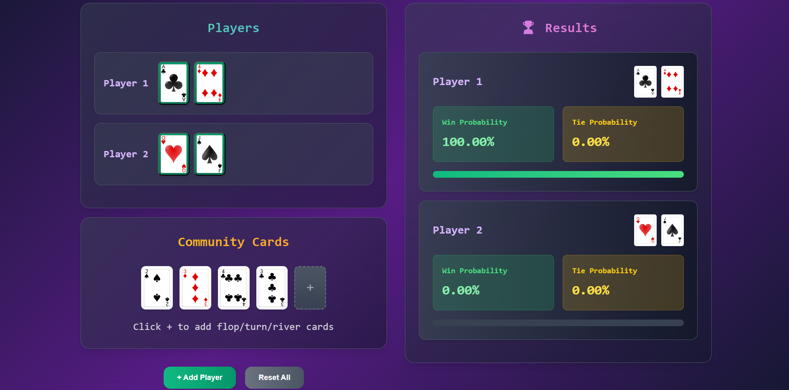
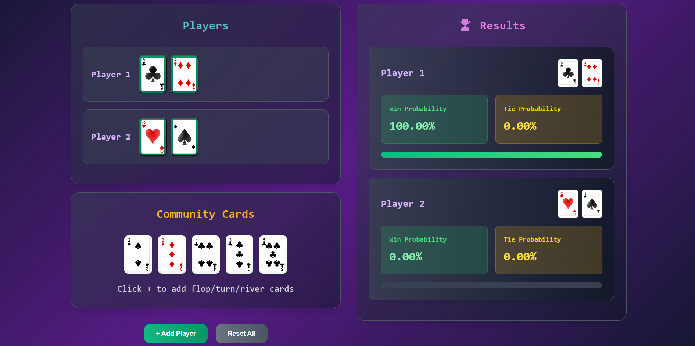
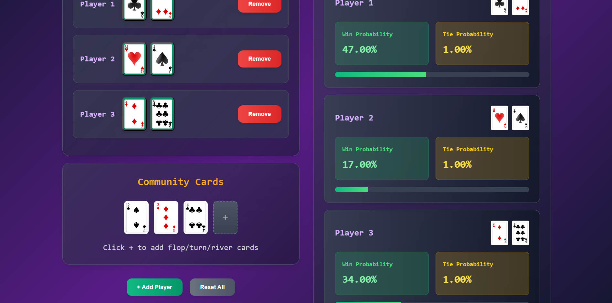

# 🃏 Poker Calculator App

A powerful and easy-to-use Poker Odds Calculator built with React to help you make smarter decisions at the table.



---

## 🛠️ Installation

Make sure you have **Node.js (v14 or higher)** and **npm** (or **yarn**) installed.

```bash
git clone https://github.com/bigBlueLizard/Poker-Odds-Calculator.git
cd Poker-Odds-Calculator
npm install
```

---

## ▶️ How to Run

### Development Mode

```bash
npm start
```

This will start the app in development mode and open it in your default browser at:

```
http://localhost:3000
```

The page will reload automatically as you edit code.

### Production Build

```bash
npm run build
```

Builds the app for production to the `build/` folder.

---
## 🚀 Features Showcase

### 🎯 Main Page


The homepage gives a clean and interactive interface where you can begin by selecting your cards.

---

### 🂡 Select Cards


Choose hole cards for each player. The card selector prevents duplicates and ensures valid hands.

---

### 📊 Pre-Flop Probabilities


As soon as hole cards are selected, the app shows each player's initial probability of winning **before community cards are revealed**.

---

### 💥 Post-Flop Probabilities


After you input the **Flop** (first three community cards), the calculator updates each player's chance of winning based on this new information.

---

### 🔁 Turn Probabilities


Adding the **Turn** (fourth community card) narrows down the outcomes and updates the winning percentages accordingly.

---

### 🌊 River Probabilities


Finally, input the **River** (fifth and final community card) to get the most accurate prediction of each player’s chance to win.

---

### 👥 Multi-Player Support


You can add more than two players. The probability calculator supports any number of players and updates the winning chances dynamically.

---

## 🛠 Tech Stack

- React
- JavaScript
- CSS
- Poker odds logic

---
